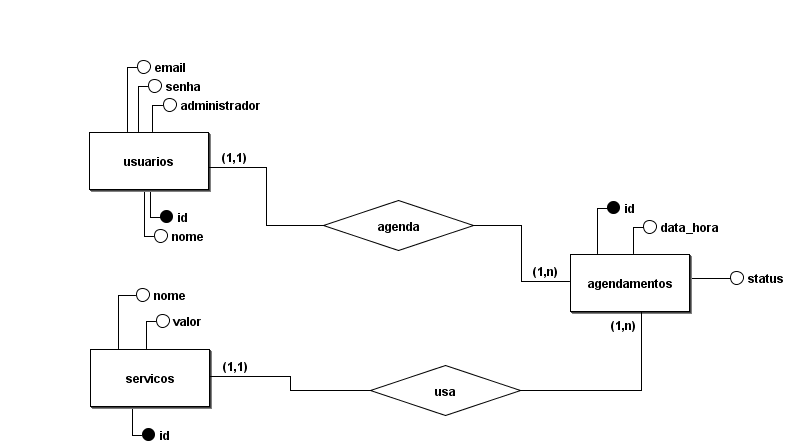

# Agendamento de Serviços

## Sobre o Projeto
Sistema que trata de agendamentos com controle de acesso para administradores, controle de agendamentos para evitar horários duplicados e sistema de usuários.

### Tecnologias
- NodeJS
- MySQL
- Express
- JSON Web Token

## Modelo Conceitual


## Modelo Lógico


## Como Executar o Projeto
**Pré requisitos:** NodeJS e Wampserver (ou XAMPP) para o servidor MySQL.

1. Faça um clone do projeto executando o seguinte comando em bash:.
  ```bash
  git clone https://github.com/mgl-uhou/backend-agendamento-servicos.git
  ```
2. Inicie um servidor para o banco de dados se conectar utilizando o Wampserver (ou XAMPP);
3. Da pasta raiz do projeto, navegue para a pasta `backend`, localize o arquivo `.env.example` e renomeie ele para apenas `.env`.
4. Preencha as variáveis do arquivo com os valores necessários, conforme a sua máquina:
   - `mysql_port`: É a porta em que seu servidor SQL está rodando.
   - `nome_adm`: É o nome que você quer definir para o seu usuário administrador.
   - `sobrenome_adm`: É o sobrenome que você quer definir para o seu usuário administrador.
   - `email_adm`: É o e-mail que você quer definir para o seu usuário administrador para testar as funções de administrador do site do site. 
   - `senha_adm`: É a senha que você quer definir para o seu usuário administrador para testar as funções de administrador do site do site.
   - `port`: É a porta que o servidor Express vai usar.
   - `mysql_host`: É o endereço do host do servidor MySQL.
   - `mysql_user`: O nome do seu usuário do MySQL.
   - `mysql_pass`: A senha do seu usuário do MySQL.
   - `mysql_db`: O nome que você quer no banco de dados que será criado na sua máquina.
5. Abra o terminal ainda na pasta `backend` e digite:
   ```powershell
   npm install
   ```
6. Depois de instalado todas as dependências, ainda em `backend` execute no terminal o comando:
   ```powershell
   npm run dev
   ```

Com esses passos concluídos, você pode testar em ambientes com ReqBin, Insomnia e Postman as seguintes rotas em `http://SEU-HOST:SUA-PORTA`:

**Usuários**
- GET `/user`: Mostra todos os usuários cadastrados no banco, para isso, você precisa usar o Bearer Token na aba de autenticação e estar cadastrado como administrador.
- GET `/profile`: Mostra o seu perfil no banco, o seu usuário, para isso, você precisa usar o Bearer Token na aba de autenticação.
- GET `user/:id`: Mostra o usuário com base em seu id, para isso você precisa usar o Bearer Token na aba de autenticação e estar cadastrado como administrador. No lugar de ":id" deve-se por o número identificador do usuário.
- POST `/cadastro`: Faz cadastro de usuários comuns, para isso, deve-se enviar no body da requisição o seguinte JSON: 
   ```json
   {
      "nome": "Nome do Usuário",
      "sobrenome": "Sobrenome do Usuário",
      "email": "email_do@usuario.com",
      "senha": "senhaDoUsuario321"
   }
   ```
- POST `/login`: Faz login do usuário. Com essa rota é possível obter o Bearer Token do usuário, que tem validade de uma hora. Deve-se enviar o seguinte JSON:
   ```json
   {
	"email": "seuEmail@gmail.com",
	"senha": "suaSenha321"
   }
   ```
- PUT `/user`: Atualiza as informações do usuário logado (uso do Bearer Token). Deve-se usar o mesmo JSON da rota /cadastro.
- DELETE `/user`: Deleta o usuário logado (uso do Bearer Token).

**Serviços**
- GET `/servicos`: Mostra todos os serviços disponíveis no banco.
- GET `/servicos/:id`: Mostra o serviço de acordo com o seu atributo identificador.
- POST `/servicos`: Somente usuários administradores podem usar essa rota, que serve para adicionar mais serviços ao banco através do JSON: 
   ```json
   {
	"nome": "Deletável",
	"valor": "130.00"
   }
   ```
- PUT `/servicos/:id`: Somente usuários adminstradores podem usar essa rota, que serve para editar os serviços através do mesmo JSON da rota anterior.
- DELETE `/servicos/:id`: Deleta o serviço de acordo com o atributo identificador. Rota usada somente por administradores.

**Agendamentos**
- GET `/agendamentos`: Mostra todos os agendamentos do mês somente para usuários administradores logados.
- GET `/agendamentos/user_id`: Mostra todos os agendamentos do usuário logado.
- GET `/agendamentos/horas`: Mostra as horas ocupadas do dia determinado através da query string data, que vem nesse formato: "data=yyyy-mm-dd".
- POST `/agendamentos`: Estando logado, adiciona um agendamento por meio do JSON: 
   ```json
   {
	"servico_id": "Número do Serviço",
	"data_hora": "yyyy-mm-ddThh:mm:ss.000Z",
	"status": "Pode ser 'pendente' ou 'concluído'."
   }
   ```
- PUT `/agendamentos/:id`: Estando logado, edita o agendamento de acordo com o atributo identificador através do mesmo JSON da rota anterior.
- DELETE `/agendamentos/:id`: Estando logado, deleta o agendamento de acordo com o atributo identificador.

## Referências

https://chatgpt.com/

https://copilot.microsoft.com/

https://www.w3schools.com/

[Vídeo sobre variáveis de ambiente](https://youtu.be/_eTCc41tnSo?si=QooHMMxdL6dmzziD)

[Como usar JSON Web Token](https://youtu.be/r4gjCn2r-iw?si=vS96gGLFR97Xuz8i)

[Construção de Backend e Organização MVC](https://youtube.com/playlist?list=PLnex8IkmReXwCyR-cGkyy8tCVAW7fGZow&si=x743a3yKGa-Ze0K7)

https://developer.mozilla.org/en-US/docs/Web/JavaScript/Reference/Global_Objects

> Miguel Ferreira